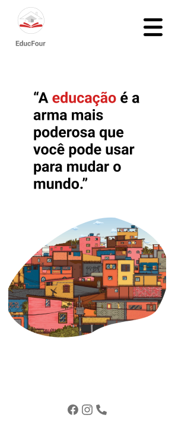
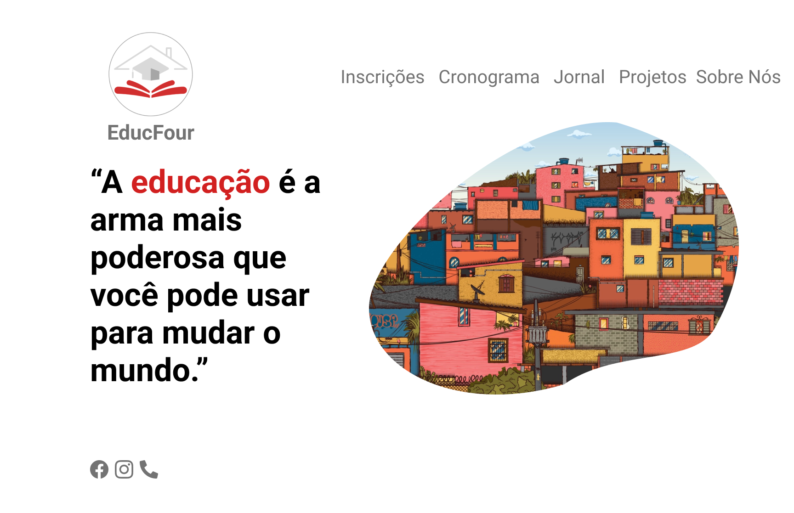

# 
EDUCFOUR

   
   <h1>SUMÁRIO</h1>
  
-  [TECNOLOGIAS APLICADAS](#tecnologias-aplicadas)
-  [FERRAMENTAS](#ferramentas)
-  [CONCEITOS APLICADOS](#conceitos-aplicados)
-  [COLABORADORES](#colaboradores)
   

   
   <h1>SOBRE</h1>   

Esse projeto foi proposto pelos professor de Front-End, Back-End e Banco de Dados com
objetivo de criar um site para um cliente.

| MOBILE                                     |             DESKTOP             |
| :----------------------------------------- | :-----------------------------: |
|  |  |

(O Layout deste site foi baseado no [Figma](https://www.figma.com/file/fs3OMtd84Y9Vs73ii53vpB/EducFour?type=design&node-id=6-45&t=zy85Bq1ZDZwWGJxr-0).)

   
   <h1>TECNOLOGIAS APLICADAS</h1>   

- HTML5
- CSS3

<h1>FERRAMENTAS</h1> 
       

   
   <h1>CONCEITOS APLICADOS</h1>   

- FRAMEWORK
- CDN
- RESPOSIVIDADE

   
   <h1>COLABORADORES</h1>   

| NOMES                                                                                                                                                                                      |                                               GITHUB                                               |                                       FOTO                                        |
| :----------------------------------------------------------------------------------------------------------------------------------------------------------------------------------------- | :------------------------------------------------------------------------------------------------: | :-------------------------------------------------------------------------------: |
|  |  | </a>  |
|  |      | </a> |
|    |  | </a> |
|    |  | </a> |
